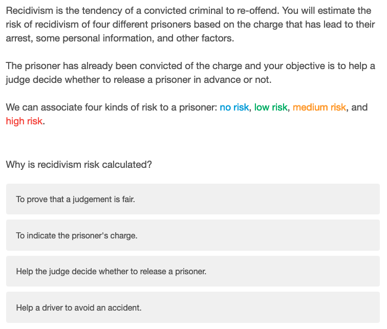
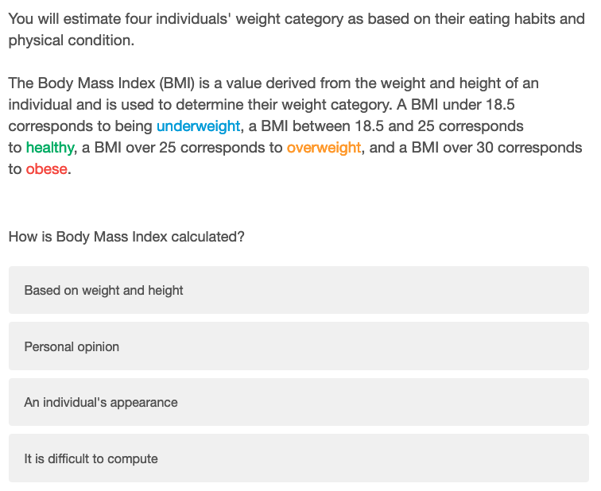
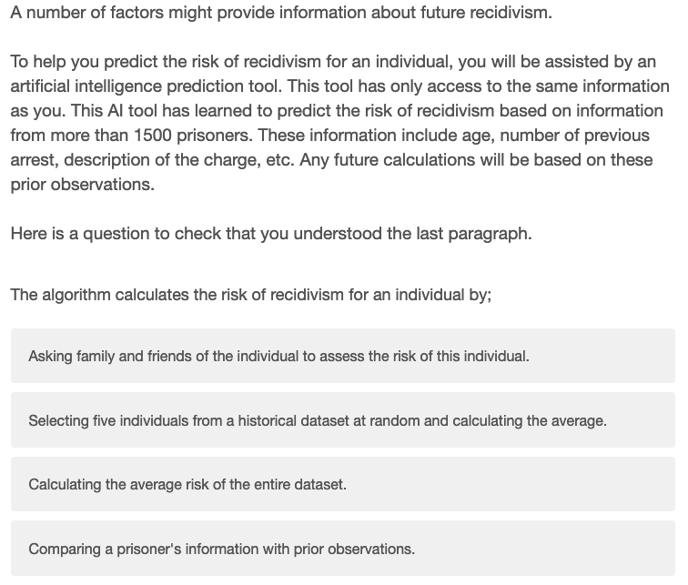
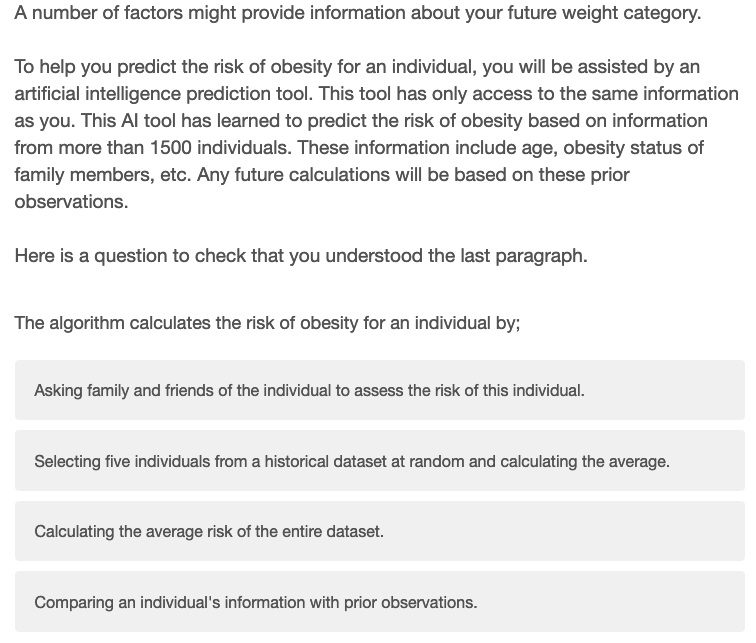

# Impact of Explanation Techniques and Representations on Users Comprehension and Confidence in Explainable AI
This repository contains the code to generate the explanation and visualization to conduct the user experiments for the paper submitted to CSCW 2024.
It also includes the code to measure the impact on users of the different explanation techniques and visualisation as well as the code to generate the graphs.

## Code Structure
* The class within generate_explanations.py contains the functions to produce the different explantions for a given dataset and machine learning model. 
    * The parameters dataset_names and models can be modified to change the dataset and model employed as classifier.
    * This class calls the function from the class VisualisationExplanation.py that computes the explanations and produces the different visualisation.
* The class generate_results.py is the main class to take the results from the user study and return .csv files with the different metrics and demographic information. Once the different csv files are produced, you can run:
    * analyse_data.r to train a linear model and generate the different ANOVA tables for Table 1 and 2.
    * generate_final_graph.py to generate the different graphs from Figure 4 to 7.

## Data processing
You may find in the class prepare_dataset.py the different functions we used to process the datasets.
Run this file to preprocess the two datasets by removing the features not used in the experiments and converting the categorical features to numerical values.

**For Compas:**
* In order to generate explanations meaningful to the users, we removed some features and keep this subset of features {Gender, Age, Race, Juvenile felony count, Juvenile misdemeanor count, Priors count, Charge degree, Charge description}. We also removed 508 individuals having a charge description that occurred less than 5 times in the whole dataset.

## Understanding Scale
In our survey, we ask the online users to complete a questionaire to evaluate the users' perceived understanding of the system from Madsen and Gregor. This questionnaire is composed of 8 questions:
1. The system uses appropriate methods to reach decisions.
1. The system has sound knowledge about this type of problem built into it.
1. The advice the system produce is as good as that which a highly competent person could produce.
1. The system makes use of all the knowledge and information available to it to produce its solution to the problem.
1. I know what will happen the next time I use the system because I understand how it behaves.
1. I understand how the system will assist me with decisions I have to make.
1. Although I may not know exactly how the system works, I know how to use it to make decisions about the problem.
1. It is easy to follow what the system does.

For each of these questions, Madsen and Gregor recommend these 5 Likert scales:
* I disagree strongly & I disagree somewhat & I'm neutral about it & I agree somewhat &  I agree strongly 

## Introduction of the domains and comprehension questions:
* We first introduce the recidivism domain through this paragraph that comes with a comprehension question for which the right answers is "Help the judge decide whether to release a prisoner."

* Similarly, we present the obesity risk background and ask this question to verify the users comprehension:

* Finally, we measure the users comprehension of how an AI predicts based on these two paragraph and question for respectively the COMPAS and Obesity datasets: 

## Online Resources
* The CSV file for the Obesity dataset can be found at this link on [Kaggle](https://www.kaggle.com/code/mpwolke/obesity-levels-life-style) and has been introduced in this [paper](https://doi.org/10.1016/j.dib.2019.104344).
* For COMPAS, the dataset can be found [here](https://www.kaggle.com/datasets/danofer/compass).
